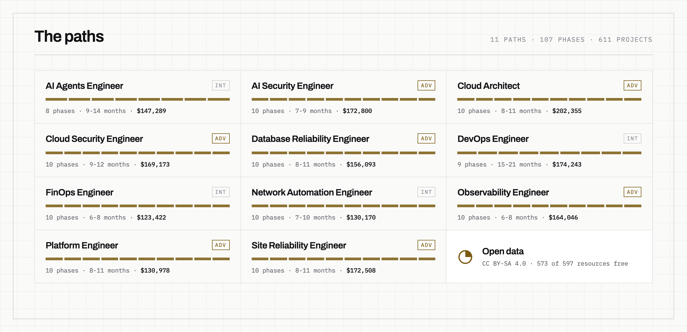
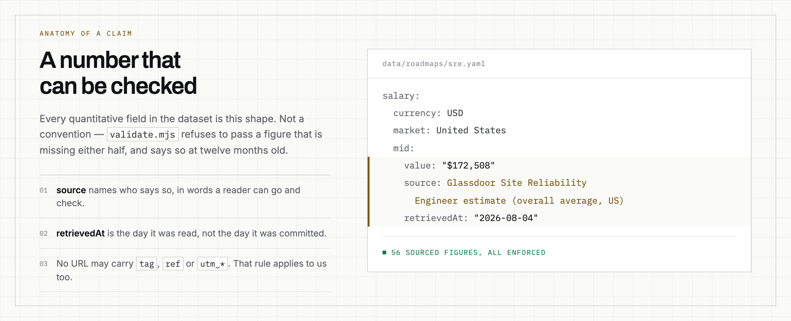

<div align="center">

<picture>
  <source media="(prefers-color-scheme: dark)" srcset="assets/banner-dark.png">
  
</picture>

<br><br>

[](../../actions/workflows/validate.yml)
[](../../actions/workflows/check-links.yml)
[](LICENSE)
[](LICENSE)
[](#using-it)

**11 career paths · 107 phases · 611 projects · 44 sourced figures**

</div>

<br>

Machine-readable career roadmaps for infrastructure and AI engineering. Each path
is ordered phases, the skills and projects that make a phase *done*, curated
resources, salary bands, and — where written — what the job is actually like once
you have it.

<br>

<picture>
  <source media="(prefers-color-scheme: dark)" srcset="assets/paths-dark.png">
  
</picture>

<br>

| Path | Level | Phases | Duration | Mid-level (US) |
|---|---|---:|---|---|
| [AI Agents Engineer](roadmaps/ai-agents-engineer.md) | Intermediate | 8 | 9-14 months | $147,289 |
| [AI Security Engineer](roadmaps/ai-security-engineer.md) | Advanced | 10 | 7-9 months | $172,800 |
| [Cloud Architect](roadmaps/cloud-architect.md) | Advanced | 10 | 8-11 months | $202,355 |
| [Cloud Security Engineer](roadmaps/cloud-security-engineer.md) | Advanced | 10 | 9-12 months | $169,173 |
| [Database Reliability Engineer](roadmaps/database-reliability-engineer.md) | Advanced | 10 | 8-11 months | $156,093 |
| [DevOps Engineer](roadmaps/devops-engineer.md) | Intermediate | 9 | 15-21 months | $174,243 |
| [FinOps Engineer](roadmaps/finops-engineer.md) | Intermediate | 10 | 6-8 months | $123,422 |
| [Network Automation Engineer](roadmaps/network-automation-engineer.md) | Intermediate | 10 | 7-10 months | $130,170 |
| [Observability Engineer](roadmaps/observability-engineer.md) | Advanced | 10 | 6-8 months | $164,046 |
| [Platform Engineer](roadmaps/platform-engineer.md) | Advanced | 10 | 8-11 months | $130,978 |
| [Site Reliability Engineer](roadmaps/sre.md) | Advanced | 10 | 8-11 months | $172,508 |

<sub>Names link to the readable view; the data behind each one is in
[`data/roadmaps`](data/roadmaps). Durations assume ~10 hours a week and are
editorial estimates, not measurements.</sub>

<br>

## What makes this different

<picture>
  <source media="(prefers-color-scheme: dark)" srcset="assets/anatomy-dark.png">
  
</picture>

<br>

**Every quantitative claim carries its source and the date it was read.** That is
not a convention contributors are asked to honour — `tools/validate.mjs` walks
every document and **fails** on a figure with no usable source or no
`retrievedAt`, and reports any figure read more than twelve months ago.

A roadmap that tells you a job pays $180k without saying who says so is an
opinion wearing a number, and there are enough of those.

The same script rejects any URL carrying a `tag`, `ref`, `aff`, `affiliate_id`
or `utm_*` parameter. See [what we sell](#who-publishes-this-and-what-we-sell).

## Honest limits of the salary data

Read this before quoting a figure at anyone.

- **These are Glassdoor estimates** — self-reported and employer-submitted data
  plus modelling. Not a survey, not a census, not payroll data.
- **United States only.** These roles vary more between US metros than some of
  these bands are wide, and no other market is represented.
- **A point in time**, stamped in `retrievedAt`. Nobody re-reads them
  continuously; CI flags them at twelve months.
- **Bands stop at senior**, because that is where public estimates thin out —
  not because the ladder ends.

Durations are labelled `SkillPilot editorial estimate`, and that is exactly what
they are: a judgement, not a measurement. They are modelled as sourced fields so
the judgement is visible rather than implied.

## Coverage, stated plainly

Not every path carries every field yet. The table says so, rather than leaving it
to be discovered file by file.

| Field | Present on |
|---|---|
| `phases`, `salary`, `totalDuration`, `prerequisites`, `faq` | **all 11** |
| `jobReality` — day-to-day, interviews, entry paths, progression, failure modes | **2** — `sre`, `finops-engineer` |
| `stages` — coarse groupings over the phases | **1** — `sre` |

`jobReality` is editorial throughout. Claims that would need a citation — how
many openings exist, what share is remote, whether demand is growing — are
deliberately not modelled rather than invented.

**573 of the 597 cited resources are free** (96%). Where a paid book is the only
route to a topic, `freeAlternative` names a free one beside it.

## Using it

```
data/roadmaps/*.yaml         source of truth — one file per path, filename == slug
roadmaps/*.md                the same thing, generated, for reading on GitHub
schema/roadmap.schema.json   JSON Schema (draft 2020-12) for the data
tools/                       validation, figures, and the Markdown renderer
```

**Read [`roadmaps/`](roadmaps), consume [`data/`](data/roadmaps).** A 44 KB YAML
file is a wall of raw text in a browser, so every path also exists as a
generated Markdown page with the phases collapsed, the sources in a table and
the resources linked. They are never edited by hand — CI regenerates them and
fails if they no longer match the data, so the readable copy cannot quietly rot.

**The dataset has no dependencies.** It is plain YAML with a published schema —
no build step, no API, nothing to install unless you want to run the checks.

```js
import { readFileSync } from 'node:fs'
import { parse } from 'yaml'

const sre = parse(readFileSync('data/roadmaps/sre.yaml', 'utf8'))
console.log(sre.phases.map((p) => `${p.title} — ${p.duration}`))
```

<details>
<summary><b>Running the checks yourself</b></summary>

<br>

```bash
cd tools
npm install --omit=dev
npm run validate         # schema, sourcing rules, cross-references — CI, every push
npm run check-markdown   # are the readable views still in sync? — CI, every push
npm run check-links      # every cited URL — CI, weekly
npm run render-markdown  # regenerate roadmaps/*.md after changing the data
```

`check-links` reaches 426 unique URLs. A dozen of them — MySQL's docs,
`platform.openai.com`, the Ansible docs — answer 403 or 429 to any automated
request and 200 to a browser, with or without a spoofed user agent. Those are
reported as blocked rather than failed: a weekly red build over links that are
perfectly alive only teaches everyone to ignore the badge.

`npm run render-assets` regenerates the figures in this README from the dataset,
so no number in them is typed by hand. It needs a local Chrome, which is why
playwright is a dev dependency CI does not install.

</details>

<details>
<summary><b>The shape of a roadmap file</b></summary>

<br>

```yaml
slug: sre
title: Site Reliability Engineer Roadmap
level: advanced
totalDuration: { value: …, source: …, retrievedAt: … }
salary:
  currency: USD
  market: United States
  entry: { value: …, source: …, retrievedAt: … }
  mid:   { … }
  senior:{ … }
prerequisites: [ … ]
phases:
  - id: reliability-foundations
    title: Reliability Foundations
    description: …          # what "done" means, not what the topic is
    duration: 3-4 weeks
    skills:   [ { name, level, category } ]
    projects: [ … ]         # 2-6, each one buildable
    resources:[ { title, type, url, provider, free } ]
jobReality: { dayToDay, interview, entryPaths, progression, failureModes }
faq: [ { question, answer } ]
```

The full contract is [`schema/roadmap.schema.json`](schema/roadmap.schema.json).

</details>

## Who publishes this, and what we sell

Maintained by **[SkillPilot](https://skillpilot.app)**, which sells paid courses
for these same career paths. Saying so up front is worth more than the usual
disclosure boilerplate, so: two commitments, both enforced rather than promised.

1. **No affiliate or referral links in this repository.** Not "we try not to" —
   `tools/validate.mjs` rejects them, so a tagged link cannot be merged. The
   dataset on the site does carry some; they were stripped on the way here.
2. **A free alternative beside every paid book** that is the only route to a
   topic. That is an editorial rule on the source content, and `freeAlternative`
   is how it survives into this dataset.

The roadmaps are complete and useful on their own. If they are all you ever take
from us, they were still worth publishing.

## Contributing

Corrections to sourced figures are the most valuable contribution here. If a
salary band is stale or wrong, open a pull request with a source and the date you
read it — see [CONTRIBUTING.md](CONTRIBUTING.md).

## Licence

- **Data** (`data/`, `schema/`) — [CC BY-SA 4.0](https://creativecommons.org/licenses/by-sa/4.0/):
  use it, translate it, build on it; keep the attribution and keep derivatives open.
- **Code** (`tools/`) — MIT.

See [LICENSE](LICENSE).
