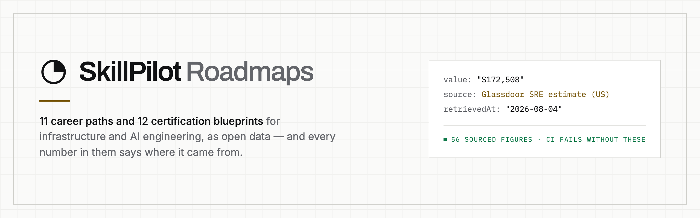

<div align="center">

<picture>
  <source media="(prefers-color-scheme: dark)" srcset="assets/banner-dark.png">
  
</picture>

<br>

**11 career paths · 107 phases · 611 projects · 44 sourced figures**

[](../../actions/workflows/validate.yml)
[](../../actions/workflows/check-links.yml)
[](LICENSE)
[](LICENSE)

</div>

---

Machine-readable career roadmaps for infrastructure and AI engineering. Each
path is ordered phases, the skills and projects that make a phase *done*,
curated resources, salary bands, and — where written — what the job is actually
like once you have it.

## The paths

| Path | Level | Phases | Duration | Mid-level (US) |
|---|---|---:|---|---|
| [AI Agents Engineer](data/roadmaps/ai-agents-engineer.yaml) | Intermediate | 8 | 9-14 months | $147,289 |
| [AI Security Engineer](data/roadmaps/ai-security-engineer.yaml) | Advanced | 10 | 7-9 months | $172,800 |
| [Cloud Architect](data/roadmaps/cloud-architect.yaml) | Advanced | 10 | 8-11 months | $202,355 |
| [Cloud Security Engineer](data/roadmaps/cloud-security-engineer.yaml) | Advanced | 10 | 9-12 months | $169,173 |
| [Database Reliability Engineer](data/roadmaps/database-reliability-engineer.yaml) | Advanced | 10 | 8-11 months | $156,093 |
| [DevOps Engineer](data/roadmaps/devops-engineer.yaml) | Intermediate | 9 | 15-21 months | $174,243 |
| [FinOps Engineer](data/roadmaps/finops-engineer.yaml) | Intermediate | 10 | 6-8 months | $123,422 |
| [Network Automation Engineer](data/roadmaps/network-automation-engineer.yaml) | Intermediate | 10 | 7-10 months | $130,170 |
| [Observability Engineer](data/roadmaps/observability-engineer.yaml) | Advanced | 10 | 6-8 months | $164,046 |
| [Platform Engineer](data/roadmaps/platform-engineer.yaml) | Advanced | 10 | 8-11 months | $130,978 |
| [Site Reliability Engineer](data/roadmaps/sre.yaml) | Advanced | 10 | 8-11 months | $172,508 |

Durations assume ~10 hours a week.

## What makes this different

**Every quantitative claim carries its source and the date it was read.**

```yaml
salary:
  currency: USD
  market: United States
  mid:
    value: "$172,508"
    source: Glassdoor Site Reliability Engineer salary estimate (overall average, US)
    retrievedAt: "2026-08-04"
```

That is not a convention contributors are asked to honour — `npm run validate`
walks every document and **fails** on a figure with no usable source or no
`retrievedAt`, and reports any figure read more than 12 months ago. A roadmap
that tells you a job pays $180k without saying who says so is an opinion
wearing a number, and there are enough of those.

The same script rejects any URL carrying a `tag`, `ref`, `aff`, `affiliate_id`
or `utm_*` parameter. See [what we sell](#who-publishes-this-and-what-we-sell).

## Honest limits of the salary data

Read this before quoting a figure at anyone:

- **These are Glassdoor estimates** — self-reported and employer-submitted data
  plus modelling. Not a survey, not a census, not payroll data.
- **United States only.** These roles vary more between US metros than some of
  these bands are wide, and no other market is represented.
- **A point in time**, stamped in `retrievedAt`. Nobody re-reads them
  continuously; CI flags them at 12 months.
- **Bands stop at senior**, because that is where public estimates thin out —
  not because the ladder ends.

Durations are labelled `SkillPilot editorial estimate`, and that is exactly what
they are: a judgement, not a measurement. They are modelled as sourced fields so
the judgement is visible rather than implied.

## Coverage, stated plainly

Not every path carries every field yet, and the table says so rather than the
gaps being discovered file by file:

| Field | Present on |
|---|---|
| `phases`, `salary`, `totalDuration`, `prerequisites`, `faq` | **all 11** |
| `jobReality` — day-to-day, interviews, entry paths, progression, failure modes | **2** (`sre`, `finops-engineer`) |
| `stages` — coarse groupings over the phases | **1** (`sre`) |

`jobReality` is editorial throughout. Claims that would need a citation — how
many openings exist, what share is remote, whether demand is growing — are
deliberately not modelled rather than invented.

**573 of the 597 cited resources are free** (96%). Where a paid book is the only
route to a topic, `freeAlternative` names a free one beside it.

## Layout

```
data/roadmaps/*.yaml         one file per path, filename == slug
schema/roadmap.schema.json   JSON Schema (draft 2020-12) for those files
scripts/validate.mjs         schema + sourcing rules + cross-references
scripts/check-links.mjs      asks every cited URL whether it is still there
```

```bash
npm install
npm run validate      # runs in CI on every push
npm run check-links   # weekly in CI; slow, hits the network
```

`check-links` reaches 426 unique URLs. A dozen of them — MySQL's docs,
`platform.openai.com`, the Ansible docs — answer 403 or 429 to any automated
request and 200 to a browser, so they are reported as blocked rather than failed:
a weekly red build over links that are perfectly alive just teaches everyone to
ignore the badge.

Consume it from any language — plain YAML with a published schema. No build
step, no API to depend on.

```js
import { readFileSync } from 'node:fs'
import { parse } from 'yaml'

const sre = parse(readFileSync('data/roadmaps/sre.yaml', 'utf8'))
console.log(sre.phases.map((p) => `${p.title} — ${p.duration}`))
```

## Who publishes this, and what we sell

Maintained by **[SkillPilot](https://skillpilot.app)**, which sells paid courses
for these same career paths. Saying so up front is worth more than the usual
disclosure boilerplate, so: two commitments, both enforced rather than promised.

1. **No affiliate or referral links in this repository.** Not "we try not to" —
   `validate.mjs` rejects them, so a tagged link cannot be merged. The dataset
   on the site does carry some; they were stripped on the way here.
2. **A free alternative beside every paid book** that is the only route to a
   topic. That is an editorial rule on the source content, and `freeAlternative`
   is how it survives into this dataset.

The roadmaps are complete and useful on their own. If they are all you ever take
from us, they were still worth publishing.

## Contributing

Corrections to sourced figures are the most valuable contribution here. If a
salary band is stale or wrong, open a pull request with a source and the date
you read it — see [CONTRIBUTING.md](CONTRIBUTING.md).

## Licence

- **Data** (`data/`, `schema/`) — [CC BY-SA 4.0](https://creativecommons.org/licenses/by-sa/4.0/):
  use it, translate it, build on it; keep the attribution and keep derivatives open.
- **Code** (`scripts/`) — MIT.

See [LICENSE](LICENSE).
